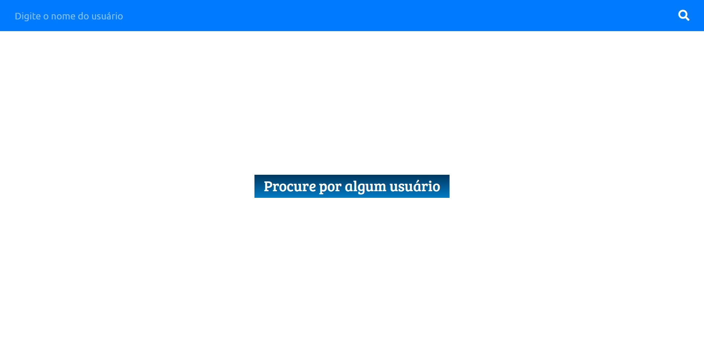

# Desafio Front-End da Desbravador Software

## Instalação
Primeiro é preciso clonar o repositório: ``git clone https://github.com/vinicius98s/desafio-desbravador.git``

Após fazer clonar o repositório é necessário fazer a instalação das dependências do projeto

```
cd desafio-bravado
yarn install
```
ou caso esteja usando npm:

```
cd desafio-bravado
npm install
```

## Modo de desenvolvimento
Para iniciar o servidor basta digitar no console:
``yarn install`` ou ``npm install``

Em seguida navegue até [http:localhost:3000](http:localhost:3000)

## Preview do projeto:
